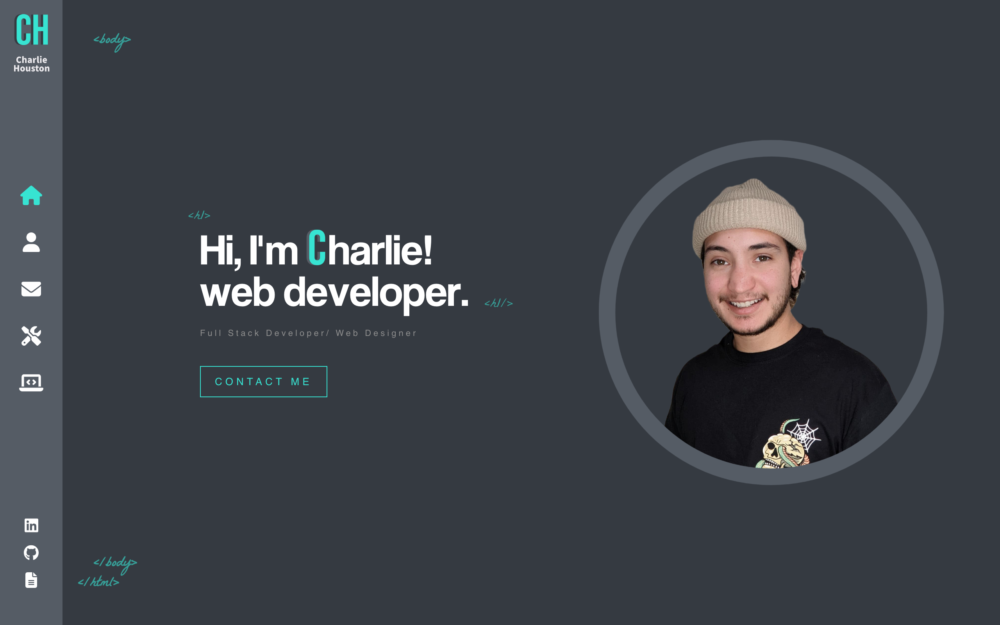
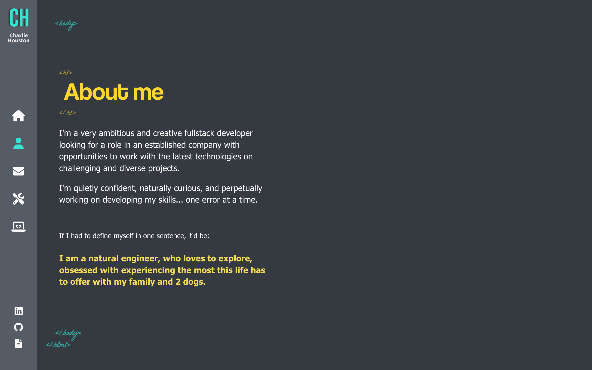
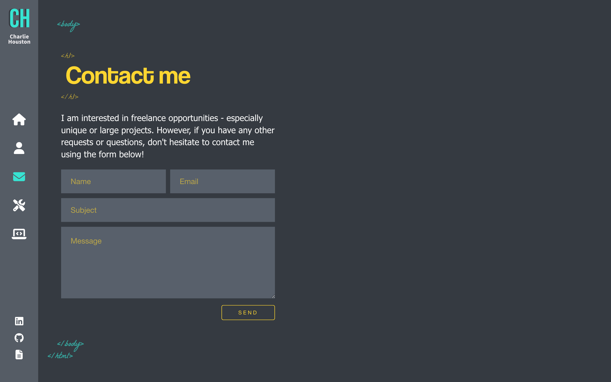
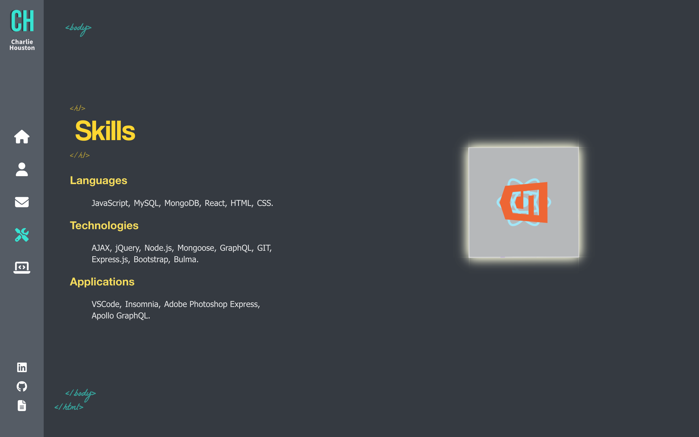
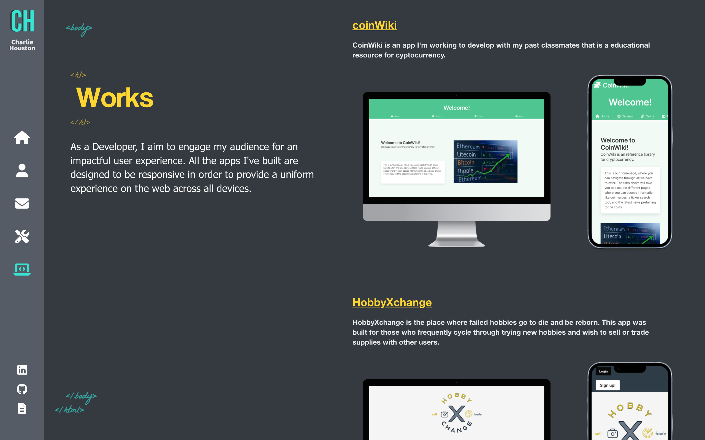

# React-portfolio
  
  
   
   

  ## Deployment
  
  https://houstoncharlie.com  

  
  
  
  
  

  <!-- 
  
  
  
   -->

   
   

  ## Description
  
  This is my portfolio website that I made using React, SCSS, and various npm packages.
  
   
   
  
  ## Table of Contents
  
  [Usage Information](#usage-information)  
  [Contribution Guidelines](#contribution-guidelines)
  [Questions](#questions)  
  
   
   
  
  ## Usage-Information

  This site was made to showcase my skills and to demonstrate my knowledge of React.  
  
   
   

  ## License
  
  MIT License
  
   
   

  ## Contribution-Guidelines
  
  I'm not accepting any contributions at this time.
  
   
   

  ## Questions
  
  GitHub Username: [@gnartistic](https://github.com/gnartistic)  
  
  Please feel free to reach out to me at [gn4rtistic@gmail.com](mailto:gn4rtistic@gmail.com) for questions

